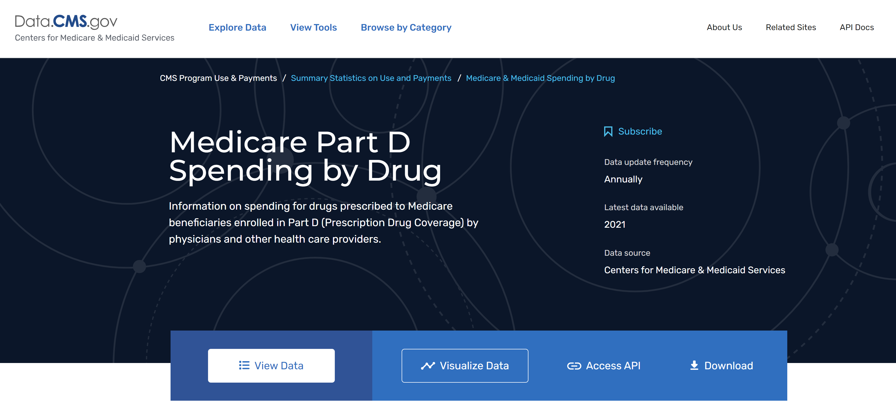

# An Analysis of CMS Part D Spending 2015 - 2019

## Background/Description

This is an in-depth analysis of CMS Part D spending from 2015 through 2019 (link here), focused around products, brands and molecules that comprise the bulk of CMS Part D spend during these years, and how Part D spending has evolved over time.

## Key Findings

The top brand by total Part D spend in 2019 was XXX, and the top manufacturer by spend was YYY.  These have changed/remained consistent since 2015, when XXX and YYY were the top brand and mftr.

[insert chart of top brands/MFTRS by spend 2019]

In terms of generic molecule, XXX has been responsible for most of CMS Part D spend...

[molecule]

