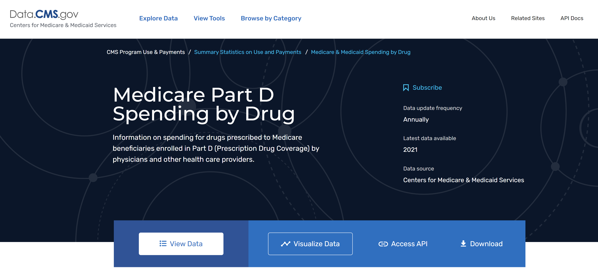
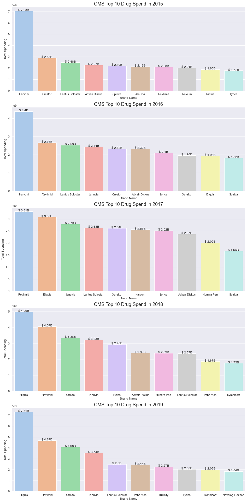

# An Analysis of CMS Part D Spending 2015 - 2019

## Background/Description

An in-depth analysis of CMS Part D spending from 2015 through 2019 ([link here](https://data.cms.gov/summary-statistics-on-use-and-payments/medicare-medicaid-spending-by-drug/medicare-part-d-spending-by-drug)), focused around products, brands and molecules that comprise the bulk of CMS Part D spend during these years, and how Part D spending has evolved over time.
Key business questions:
* What are the top Part D products by spend in 2019?
* How have the top products evolved from 2015 through 2019?
* Who are the largest Part D manufacturers by total spend and total claims?
* What conditions are the top products indicated for?

## Key Learnings
* Data collection
* Data wrangling
* Regular Expressions (Regex)
* Data visualization (matplotlib)

## Key Findings

* Overall Part D spending **increased 37%**  from 2015 to 2019, up to $183B.
* The top brand by total Part D spend in 2019 was Eliquis, a blood thinner manufactured by Bristol-Myers Squibb.  The top brand by spend in 2015 was Gilead's Harvoni.
* The top manufacturer by spend in 2019 was Novo Nordisk with almost $10B in total spend.

